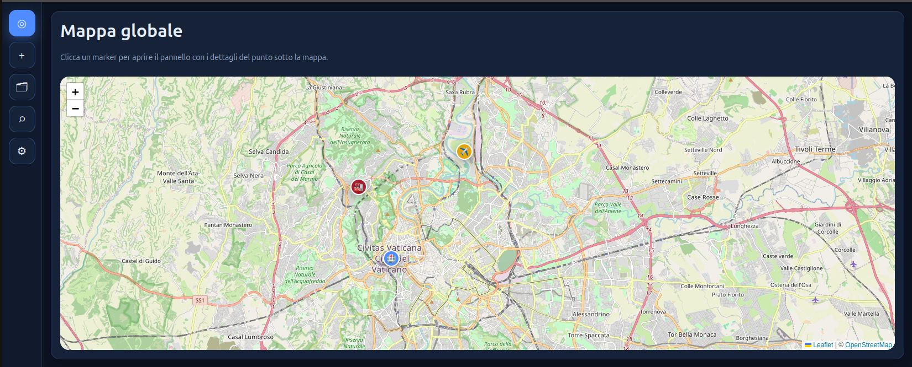
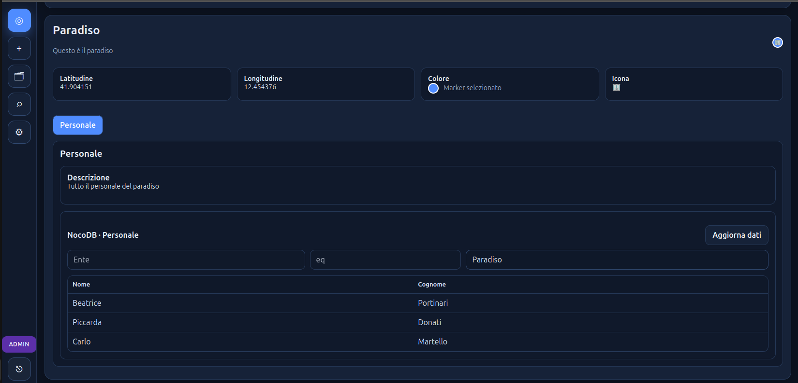

# Geo Intel MVP

<p align="center">
  
</p>

<p align="center">
  
</p>

**Geo Intel MVP** is a tool designed for the **intel component**, useful for **aggregating, organizing, and visualizing georeferenced information on a map**.  
For each point, it is possible to collect structured content such as **descriptions, images, documents**, and external data integrated through **NocoDB**, creating a centralized and easy-to-consult information view.

The goal of the project is to provide a simple, extensible, and immediate platform for the **management of map-based information points**, with a visual component oriented toward operational analysis and consultation.

---

## Main Features

- Map-based point visualization
- Creation and editing of georeferenced points
- Marker customization:
  - color
  - icon
- Management of multiple **tabs** for each point
- Content insertion for each tab:
  - description
  - photos / image slider
  - documents
  - NocoDB data table
- **NocoDB** integration
- Dynamic filters on linked tables
- Selection of visible columns for each tab
- Text search for points
- Contextual attachment management
- Cyber/minimal interface designed for operational use

---

## Use Cases

This tool can be used for:

- territorial information collection
- support for OSINT / intel activities
- mapping infrastructure, assets, or subjects
- management of investigative points of interest
- consultation of information sheets enriched with documents and images
- aggregation of external datasets through NocoDB
- creation of a geolocated knowledge base

---

## Architectural Overview

The project is composed of three main services:

- **Frontend**: React/Vite user interface
- **Backend**: REST API developed with FastAPI
- **Database**: PostgreSQL for data persistence

### Technology Stack

- **Frontend**
  - React
  - Vite
  - Custom CSS
- **Backend**
  - FastAPI
  - SQLAlchemy
  - Pydantic
- **Database**
  - PostgreSQL
- **Local deployment**
  - Docker
  - Docker Compose
- **External integration**
  - NocoDB API

---

## Core Concepts

### Point
A point represents a geolocated element on the map.

Each point can include:
- name
- description
- coordinates
- marker color
- marker icon
- main image
- multiple information tabs

### Tab
Each point can be organized into one or more tabs, each with separate content.

Examples:
- General Sheet
- Documentation
- Photos
- NocoDB Data
- Operational Notes

### Tab Modules
Each tab can enable one or more modules:
- **Description**
- **Photos (slider)**
- **Documents**
- **NocoDB Table**

---

## NocoDB Integration

One of the most useful aspects of the project is the ability to connect a tab to a **NocoDB** table.

For each tab, it is possible to:
- choose a NocoDB table
- load available columns
- select which columns to display
- apply filters
- view the data directly within the point context

This allows each map point to be enriched with dynamic data coming from an external structured data source.

## Quick Start

### 1. Clone or extract the project

```bash
git clone <repo-url>
cd geo-intel-mvp
```

Or extract the project zip archive.

### 2. Configure the `.env` file

Fill in the required variables, especially those related to:
- database
- authentication
- NocoDB

Example:

```env
POSTGRES_DB=geointel
POSTGRES_USER=geointel
POSTGRES_PASSWORD=changeme

SECRET_KEY=super-secret-key

NOCODB_BASE_URL=http://your-nocodb-instance
NOCODB_API_TOKEN=your_token_here
NOCODB_BASE_ID=your_base_id_here
```

### 3. Start the stack

```bash
docker compose up --build
```

### 4. Access the application

Typically:
- frontend: `http://localhost`
- backend API: `http://localhost:8000`

---

